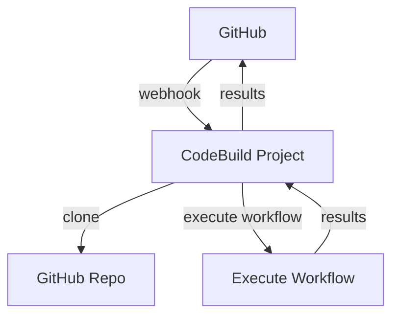

# CDK Construct for CodeBuild-Hosted GitHub Actions Runner

This project provides an AWS CDK construct that creates a CodeBuild project for running GitHub Actions workflows.

The `CodebuildHostedGitHubActionsRunner` construct allows you to easily set up an AWS CodeBuild project that can be used as a runner for GitHub Actions. This enables you to leverage AWS infrastructure for your GitHub Actions workflows, providing a scalable and cost-effective solution for CI/CD pipelines.

## Repository Structure

```
.
├── API.md
├── package.json
├── README.md
├── src
│   └── index.ts
└── tsconfig.dev.json
```

- `src/index.ts`: Contains the main implementation of the `CodebuildHostedGitHubActionsRunner` construct.
- `package.json`: Defines the project dependencies and scripts.
- `tsconfig.dev.json`: TypeScript configuration for development.

## Usage Instructions

### Installation

To use this construct in your AWS CDK project, install it via npm:

```bash
npm install @nikovirtala/cdk-codebuild-hosted-github-actions-runner
```

### Getting Started

Here's a basic example of how to use the `CodebuildHostedGitHubActionsRunner` construct in your CDK stack:

```typescript
import { Stack, StackProps } from 'aws-cdk-lib';
import { Construct } from 'constructs';
import { CodebuildHostedGitHubActionsRunner } from '@nikovirtala/cdk-codebuild-hosted-github-actions-runner';

export class MyStack extends Stack {
  constructor(scope: Construct, id: string, props?: StackProps) {
    super(scope, id, props);

    new CodebuildHostedGitHubActionsRunner(this, 'GitHubActionsRunner', {
      repositoryOwner: 'myorg',
      repositoryName: 'myrepo',
      tokenSecretArn: 'arn:aws:secretsmanager:region:account-id:secret:my-github-token',
    });
  }
}
```

### Configuration Options

The `CodebuildHostedGitHubActionsRunner` construct accepts the following properties:

- `codeBuildProjectName` (optional): The name of the CodeBuild project. If not provided, a name is generated based on the repository owner and name.
- `repositoryOwner` (required): The owner of the GitHub repository.
- `repositoryName` (required): The name of the GitHub repository.
- `tokenSecretArn` (optional): The ARN of the Secrets Manager secret containing the GitHub token. This is required if the GitHub repository is private.

### Integration with GitHub Actions

To use this CodeBuild project as a runner for your GitHub Actions workflows, you'll need to configure your workflow to use self-hosted runners. Here's an example workflow:

```yaml
name: My Workflow

on:
  push:
    branches: [ main ]

jobs:
  build:
    runs-on: self-hosted
    steps:
      - uses: actions/checkout@v2
      - name: Run a one-line script
        run: echo 'Hello, world!'
```

### Troubleshooting

#### Common Issues

1. **GitHub Token Not Recognized**
   - Problem: The CodeBuild project fails to authenticate with GitHub.
   - Error Message: "Unable to access the repository. Please check the source definition of your project."
   - Solution:
     1. Verify that the GitHub token is correctly stored in AWS Secrets Manager.
     2. Ensure the `tokenSecretArn` property is correctly set in the construct.
     3. Check if the token has the necessary permissions for the repository.

2. **CodeBuild Project Creation Fails**
   - Problem: The CDK deployment fails when creating the CodeBuild project.
   - Error Message: "Resource handler returned message: "Invalid request provided" (RequestToken: ...)"
   - Solution:
     1. Check if you have the necessary permissions to create CodeBuild projects.
     2. Verify that the provided repository owner and name are correct.
     3. Ensure you're not exceeding any AWS account limits for CodeBuild projects.

#### Debugging

To enable verbose logging for the CDK deployment:

```bash
cdk deploy --debug
```

This will provide more detailed information about the deployment process and any errors encountered.

## Data Flow

The `CodebuildHostedGitHubActionsRunner` construct sets up a CodeBuild project that integrates with GitHub Actions. Here's how the data flows through the system:

1. GitHub Action Workflow Triggered
2. GitHub sends a webhook event to CodeBuild
3. CodeBuild Project receives the webhook
4. CodeBuild Project clones the GitHub repository
5. CodeBuild executes the GitHub Actions workflow
6. Results are sent back to GitHub



Note: If a GitHub token is provided, the construct creates a GitHub source credential in CodeBuild to allow access to private repositories.

## Infrastructure

The `CodebuildHostedGitHubActionsRunner` construct creates the following AWS resources:

- AWS CodeBuild Project:
  - Type: `aws_codebuild.Project`
  - Purpose: Runs GitHub Actions workflows

- GitHub Source Credentials (if token provided):
  - Type: `aws_codebuild.GitHubSourceCredentials`
  - Purpose: Authenticates CodeBuild with GitHub for private repositories

The construct also references an existing AWS Secrets Manager secret if a `tokenSecretArn` is provided.